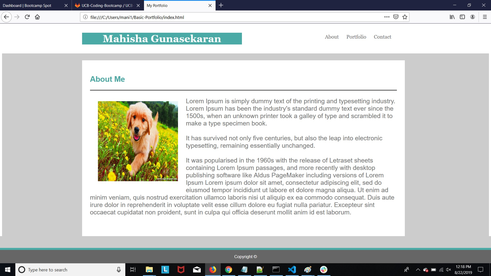
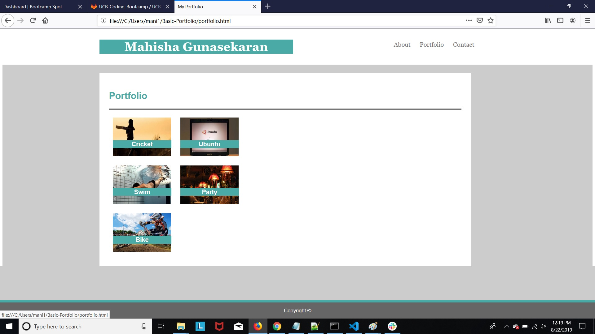
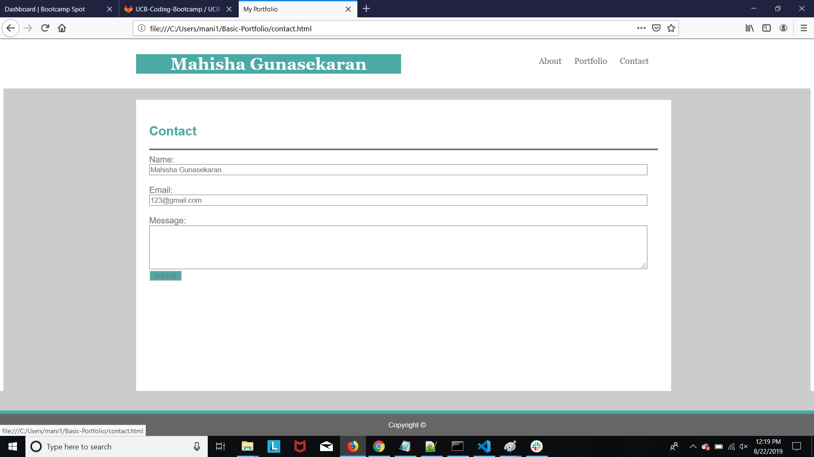

# Basic Portfolio

## Site pictures




## Technologies Used
- HTML : used to create elements on the DOM
- CSS  : Styles html elements on page
- Git : version control system to track changes to source code
- GitHub : hosts repository that can be deployed to GitHub pages

## Summary
### Built a professional portfolio site using HTML/CSS. This website basically has three web pages linked to each other. Applied different concepts like divisions, floating, padding to appear neat.

## Code Snippet
```HTML
            <div id="header">
               <header>
                    <h1 id="name">Mahisha Gunasekaran</h1>
                    <div id="link_header">
                        <a href="index.html">About</a>
                        <a href="portfolio.html">Portfolio</a>
                        <a href="contact.html">Contact</a>
                    </div>
                </header>
            </div>
```


## Author Links
[LinkedIn](https://www.linkedin.com/in/mahisha-gunasekaran-0a780a88/)

[GitHub](https://github.com/Mahi-Mani)

